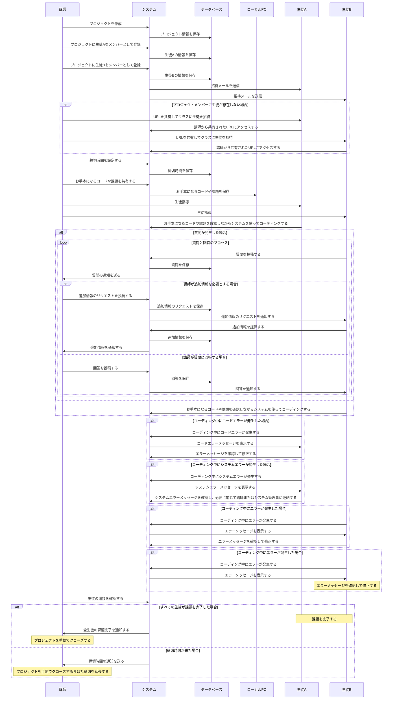

# 設計
## 業務フロー

### プロジェクト作成フェーズ




```mermaid
sequenceDiagram
    participant 講師
    participant システム
    participant データベース
    participant ローカルPC
    participant 生徒A
    participant 生徒B

    講師->>システム: プロジェクトを作成(権限: プロジェクト作成)
    システム->>データベース: プロジェクト情報を保存

    講師->>システム: プロジェクトメンバーを登録(権限: 生徒招待)
        alt 生徒情報が存在しない場合
            講師->>生徒A: URLを共有してクラスに生徒を招待
            生徒A->>システム: 講師から共有されたURLにアクセスする
            講師->>生徒B: URLを共有してクラスに生徒を招待
            生徒B->>システム: 講師から共有されたURLにアクセスする
        end
    システム->>データベース: 生徒情報を保存
    システム->>生徒A: 招待メールを送信(権限: 生徒招待)
    システム->>生徒B: 招待メールを送信(権限: 生徒招待)

    講師->>システム: 締切時間を設定(権限: 締切設定)
    システム->>データベース: 締切時間を保存

    講師->>システム: お手本になるコードや課題を共有(権限: コード課題共有)
    システム->>ローカルPC: お手本になるコードや課題を保存

    講師->>生徒A: 生徒指導
    講師->>生徒B: 生徒指導

    loop 生徒の学習・質問・評価
        生徒A->>システム: コードをコーディング
        alt 質問が発生した場合
            ref <質問と回答のプロセス>
        else
            生徒B->>システム: コードをコーディング
        end

        alt コーディング中にエラーが発生した場合
            ref <エラー処理>
        end

        講師->>システム: 生徒の進捗を確認(権限: 進捗確認)
        システム->>データベース: 生徒の進捗情報を保存
    end

    alt すべての生徒が課題を完了した場合
        note over 生徒A, 生徒B: 課題を完了する
        システム->>講師: 全生徒の課題完了を通知
        note over 講師: プロジェクトを手動でクローズする
    else 締切時間が来た場合
        システム->>講師: 締切時間の通知を送信
        note over 講師: プロジェクトを手動でクローズするまはた締切を延長する
    end
```
