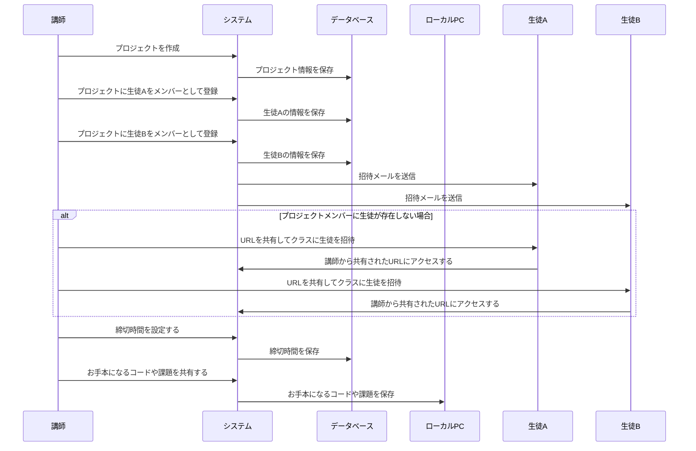
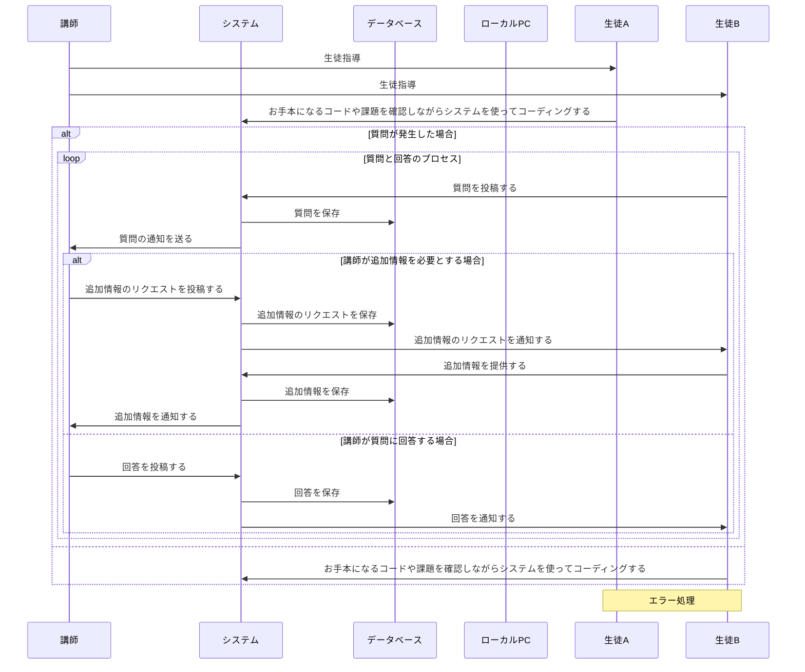
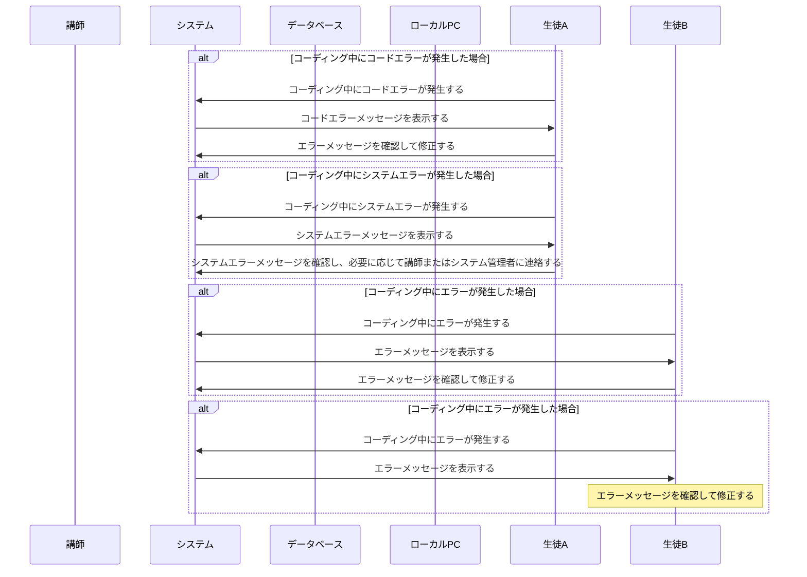
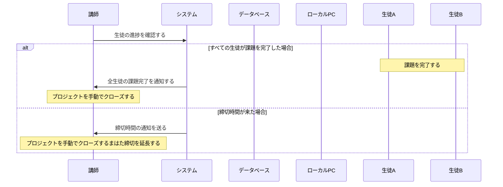

# 設計
## 業務フロー
### プロジェクト作成フェーズ

### コーディング、質問と回答のプロセス

### エラー処理

### プロジェクトCLOSEDフェーズ

## 画面遷移図

<iframe style="border: 1px solid rgba(0, 0, 0, 0.1);" width="800" height="450" src="https://www.figma.com/embed?embed_host=share&url=https%3A%2F%2Fwww.figma.com%2Fdesign%2FYHIhf7m3YkQLXCtAyU2VyG%2FIruka-Code-%25E7%2594%25BB%25E9%259D%25A2%25E9%2581%25B7%25E7%25A7%25BB%25E5%259B%25B3%3Fnode-id%3D0%253A1%26t%3De7h0zm3U5zh9Ogh8-1" allowfullscreen></iframe>

### URL
[https://www.figma.com/design/YHIhf7m3YkQLXCtAyU2VyG/Iruka-Code-%E7%94%BB%E9%9D%A2%E9%81%B7%E7%A7%BB%E5%9B%B3?node-id=0-1&t=e7h0zm3U5zh9Ogh8-0](https://www.figma.com/design/YHIhf7m3YkQLXCtAyU2VyG/Iruka-Code-%E7%94%BB%E9%9D%A2%E9%81%B7%E7%A7%BB%E5%9B%B3?node-id=0-1&t=e7h0zm3U5zh9Ogh8-0)
