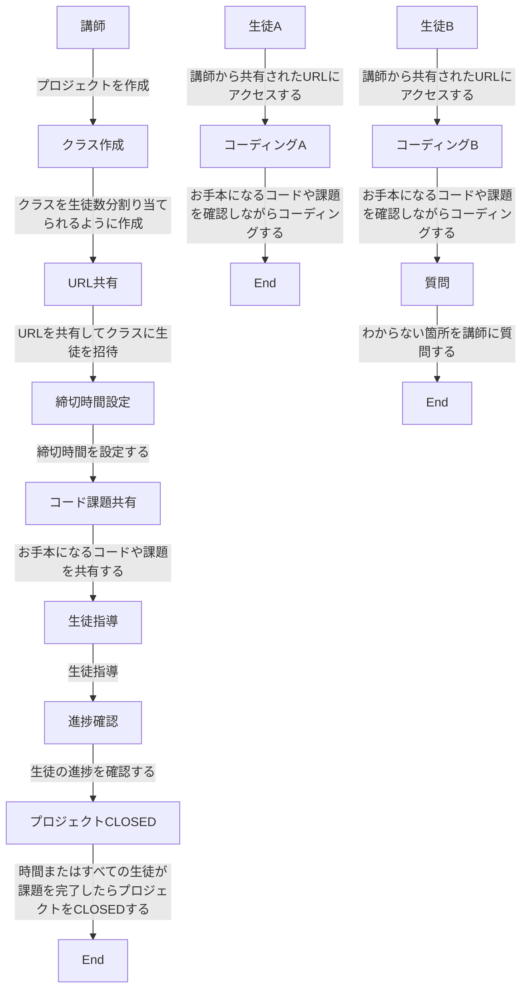

# 設計
## 業務フロー

```mermaid
graph TB
    講師 -->|プロジェクトを作成| クラス作成
    クラス作成 -->|クラスを生徒数分割り当てられるように作成| URL共有
    URL共有 -->|URLを共有してクラスに生徒を招待| 締切時間設定
    締切時間設定 -->|締切時間を設定する| コード課題共有
    コード課題共有 -->|お手本になるコードや課題を共有する| 生徒指導
    生徒指導 -->|生徒指導| 進捗確認
    進捗確認 -->|生徒の進捗を確認する| プロジェクトCLOSED
    プロジェクトCLOSED -->|時間またはすべての生徒が課題を完了したらプロジェクトをCLOSEDする| end1[End]
    生徒A -->|講師から共有されたURLにアクセスする| コーディングA
    コーディングA -->|お手本になるコードや課題を確認しながらコーディングする| end2[End]
    生徒B -->|講師から共有されたURLにアクセスする| コーディングB
    コーディングB -->|お手本になるコードや課題を確認しながらコーディングする| 質問
    質問 -->|わからない箇所を講師に質問する| end3[End]
```
