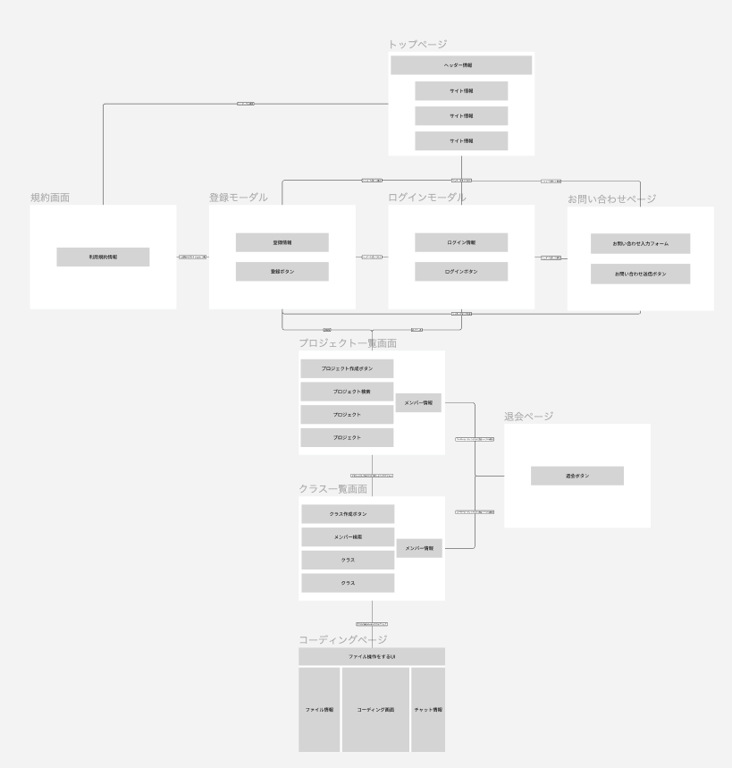

# 設計
## 業務フロー
### プロジェクト作成フェーズ

### コーディング、質問と回答のプロセス

### エラー処理

### プロジェクトCLOSEDフェーズ

## 画面遷移図

### URL
[https://www.figma.com/design/YHIhf7m3YkQLXCtAyU2VyG/Iruka-Code-%E7%94%BB%E9%9D%A2%E9%81%B7%E7%A7%BB%E5%9B%B3?node-id=0-1&t=e7h0zm3U5zh9Ogh8-0](https://www.figma.com/design/YHIhf7m3YkQLXCtAyU2VyG/Iruka-Code-%E7%94%BB%E9%9D%A2%E9%81%B7%E7%A7%BB%E5%9B%B3?node-id=0-1&t=e7h0zm3U5zh9Ogh8-0)

## ワイアーフレーム

### URL
[https://www.figma.com/design/cItZoSDVeRNs1e1wRm2cvI/%E3%83%AF%E3%82%A4%E3%83%A4%E3%83%BC%E3%83%95%E3%83%AC%E3%83%BC%E3%83%A0?node-id=0-1&t=J9i4kgLDVBqhkVf1-0](https://www.figma.com/design/cItZoSDVeRNs1e1wRm2cvI/%E3%83%AF%E3%82%A4%E3%83%A4%E3%83%BC%E3%83%95%E3%83%AC%E3%83%BC%E3%83%A0?node-id=0-1&t=J9i4kgLDVBqhkVf1-0)

## ER図

## テーブル定義書

### Usersテーブル
| 項目名 | データ型 | 初期値 | 必須 | インデックス | 主キー |
| --- | --- | --- | --- | --- | --- |
| id | INT | AUTO_INCREMENT | Yes | Yes | Yes |
| username | VARCHAR(50) | NULL | Yes | No | No |
| email | VARCHAR(255) | NULL | Yes | Yes | No |
|image_url| VARCHAR(255) | NULL | No | No | No |
| password | VARCHAR(128) | NULL | Yes | No | No |
| created_at | TIMESTAMP | CURRENT_TIMESTAMP | No | No | No |
| updated_at | TIMESTAMP | CURRENT_TIMESTAMP | No | No | No |
delete_flag | BOOLEAN | FALSE | No | No | No |

## Teamsテーブル
| 項目名 | データ型 | 初期値 | 必須 | インデックス | 主キー |
| --- | --- | --- | --- | --- | --- |
| team_id | INT | AUTO_INCREMENT | Yes | Yes | Yes |
| leader_id | INT | NULL | Yes | No | No |
| team_name | VARCHAR(255) | NULL | Yes | No | No |
| created_at | TIMESTAMP | CURRENT_TIMESTAMP | No | No | No |
| updated_at | TIMESTAMP | CURRENT_TIMESTAMP | No | No | No |
| deleted_flag | BOOLEAN | FALSE | No | No | No |

### Projectsテーブル
| 項目名 | データ型 | 初期値 | 必須 | インデックス | 主キー |
| --- | --- | --- | --- | --- | --- |
| project_id | INT | AUTO_INCREMENT | Yes | Yes | Yes |
| team_id | INT | NULL | Yes | No | No |
| project_name | VARCHAR(255) | NULL | Yes | No | No |
| start_timestamp | DATETIME | CURRENT_TIMESTAMP | No | No | No |
| end_timestamp | DATETIME | NULL | No | No | No |
| is_open | BOOLEAN | TRUE | No | No | No |
| description | TEXT | NULL | No | No | No |
| created_at | TIMESTAMP | CURRENT_TIMESTAMP | No | No | No |
| updated_at | TIMESTAMP | CURRENT_TIMESTAMP | No | No | No |
| max_participant_count | INT | NULL | Yes | No | No |
| max_class_num | INT | NULL | Yes | No | No |
| deleted_flag | BOOLEAN | FALSE | No | No | No |

### Leader_Access_Datetimeテーブル
| 項目名 | データ型 | 初期値 | 必須 | インデックス | 主キー |
| --- | --- | --- | --- | --- | --- |
| leader_id | INT | NULL | Yes | No | No |
| project_id | INT | NULL | Yes | No | No |
| access_date | DATETIME | CURRENT_TIMESTAMP | No | No | No |

### Classesテーブル
| 項目名 | データ型 | 初期値 | 必須 | インデックス | 主キー |
| --- | --- | --- | --- | --- | --- |
| class_id | INT | AUTO_INCREMENT | Yes | Yes | Yes |
| project_id | INT | NULL | Yes | No | No |
| class_name | VARCHAR(255) | NULL | Yes | No | No |
| start_timestamp | DATETIME | CURRENT_TIMESTAMP | No | No | No |
| end_timestamp | DATETIME | NULL | No | No | No |
| is_open | BOOLEAN | TRUE | No | No | No |
| deleted_flag | BOOLEAN | FALSE | No | No | No |
| max_participant_count | INT | NULL | Yes | No | No |

### Class_memosテーブル
| 項目名 | データ型 | 初期値 | 必須 | インデックス | 主キー |
| --- | --- | --- | --- | --- | --- |
| memo_id | INT | AUTO_INCREMENT | Yes | Yes | Yes |
| class_id | INT | NULL | Yes | No | No |
| leader_id | INT | NULL | Yes | No | No |
| memo_title | VARCHAR(255) | NULL | Yes | No | No |
| memo_content | TEXT | NULL | No | No | No |
| created_at | TIMESTAMP | CURRENT_TIMESTAMP | No | No | No |
| updated_at | TIMESTAMP | CURRENT_TIMESTAMP | No | No | No |
| deleted_flag | BOOLEAN | FALSE | No | No | No |

### Membersテーブル
| 項目名 | データ型 | 初期値 | 必須 | インデックス | 主キー |
| --- | --- | --- | --- | --- | --- |
| member_id | INT | AUTO_INCREMENT | Yes | Yes | Yes |
| user_id | INT | NULL | Yes | No | No |
| class_id | INT | NULL | Yes | No | No |
| access_date | TIMESTAMP | CURRENT_TIMESTAMP | No | No | No |

### Member_Memosテーブル
| 項目名 | データ型 | 初期値 | 必須 | インデックス | 主キー |
| --- | --- | --- | --- | --- | --- |
| member_memo_id | INT | AUTO_INCREMENT | Yes | Yes | Yes |
| member_id | INT | NULL | Yes | No | No |
| memo_id | INT | NULL | Yes | No | No |
| memo_content | TEXT | NULL | No | No | No |
| created_at | TIMESTAMP | CURRENT_TIMESTAMP | No | No | No |
| updated_at | TIMESTAMP | CURRENT_TIMESTAMP | No | No | No |
| deleted_flag | BOOLEAN | FALSE | No | No | No |

### Commentsテーブル
| 項目名 | データ型 | 初期値 | 必須 | インデックス | 主キー |
| --- | --- | --- | --- | --- | --- |
| comment_id | INT | AUTO_INCREMENT | Yes | Yes | Yes |
| class_id | INT | NULL | Yes | No | No |
| user_id | INT | NULL | Yes | No | No |
| comment_title | VARCHAR(255) | NULL | Yes | No | No |
| comment_content | TEXT | NULL | No | No | No |
| is_solved | BOOLEAN | FALSE | No | No | No |
| is_answer | BOOLEAN | FALSE | No | No | No |
| created_at | TIMESTAMP | CURRENT_TIMESTAMP | No | No | No |
| updated_at | TIMESTAMP | CURRENT_TIMESTAMP | No | No | No |
| deleted_flag | BOOLEAN | FALSE | No | No | No |

### Comment_Targetsテーブル
| 項目名 | データ型 | 初期値 | 必須 | インデックス | 主キー |
| --- | --- | --- | --- | --- | --- |
| comment_id | INT | NULL | Yes | Yes | Yes |
| target_id | INT | NULL | Yes | No | No |

### Comment_Tagsテーブル
| 項目名 | データ型 | 初期値 | 必須 | インデックス | 主キー |
| --- | --- | --- | --- | --- | --- |
| tag_id | INT | AUTO_INCREMENT | Yes | Yes | Yes |
| tag_name | VARCHAR(50) | NULL | Yes | No | No |
| project_id | INT | NULL | Yes | No | No |

### Comment_Tag_Pivotテーブル
| 項目名 | データ型 | 初期値 | 必須 | インデックス | 主キー |
| --- | --- | --- | --- | --- | --- |
| comment_id | INT | NULL | Yes | Yes | Yes |
| tag_id | INT | NULL | Yes | No | No |

### Comment_Filesテーブル
| 項目名 | データ型 | 初期値 | 必須 | インデックス | 主キー |
| --- | --- | --- | --- | --- | --- |
| file_id | INT | AUTO_INCREMENT | Yes | Yes | Yes |
| comment_id | INT | NULL | Yes | No | No |
| file_name | VARCHAR(50) | NULL | Yes | No | No |
| created_at | TIMESTAMP | CURRENT_TIMESTAMP | No | No | No |
| updated_at | TIMESTAMP | CURRENT_TIMESTAMP | No | No | No |
| deleted_flag | BOOLEAN | FALSE | No | No | No |

### Comment_Positionsテーブル
| 項目名 | データ型 | 初期値 | 必須 | インデックス | 主キー |
| --- | --- | --- | --- | --- | --- |
| position_id | INT | AUTO_INCREMENT | Yes | Yes | Yes |
| comment_id | INT | NULL | Yes | No | No |
| start_text_position | INT | NULL | Yes | No | No |
| end_text_position | INT | NULL | Yes | No | No |
| coding_area_position | VARCHAR(255) | NULL | Yes | No | No |
| created_at | TIMESTAMP | CURRENT_TIMESTAMP | No | No | No |
| updated_at | TIMESTAMP | CURRENT_TIMESTAMP | No | No | No |
| deleted_flag | BOOLEAN | FALSE | No | No | No |

### Answersテーブル
| 項目名 | データ型 | 初期値 | 必須 | インデックス | 主キー |
| --- | --- | --- | --- | --- | --- |
| answer_id | INT | AUTO_INCREMENT | Yes | Yes | Yes |
| comment_id | INT | NULL | Yes | No | No |
| user_id | INT | NULL | Yes | No | No |
| answer_content | TEXT | NULL | No | No | No |
| created_at | TIMESTAMP | CURRENT_TIMESTAMP | No | No | No |
| updated_at | TIMESTAMP | CURRENT_TIMESTAMP | No | No | No |
| deleted_flag | BOOLEAN | FALSE | No | No | No |

## システム構成図 (アプリケーション版)

